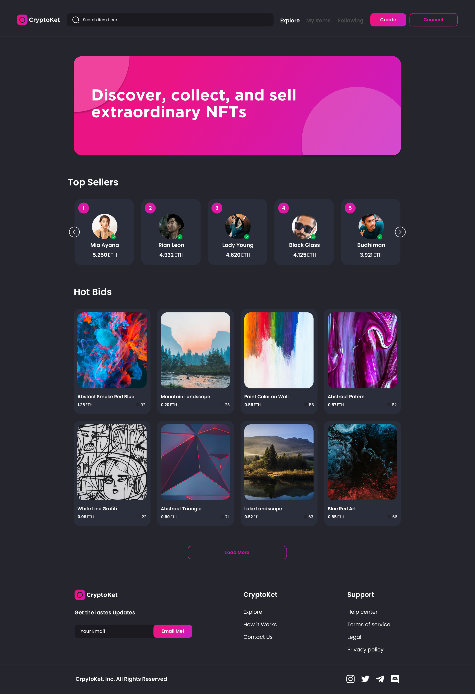

# CryptoKet

<!-- Improved compatibility of back to top link: See: https://github.com/minhtran241/cryptoket/pull/73 -->

<!--
*** Thanks for checking out the cryptoket. If you have a suggestion
*** that would make this better, please fork the repo and create a pull request
*** or simply open an issue with the tag "enhancement".
*** Don't forget to give the project a star!
*** Thanks again! Now go create something AMAZING! :D
-->

<!-- PROJECT SHIELDS -->
<!--
*** I'm using markdown "reference style" links for readability.
*** Reference links are enclosed in brackets [ ] instead of parentheses ( ).
*** See the bottom of this document for the declaration of the reference variables
*** for contributors-url, forks-url, etc. This is an optional, concise syntax you may use.
*** https://www.markdownguide.org/basic-syntax/#reference-style-links
-->

<!-- PROJECT LOGO -->
 

  

  <h3 align="center">CryptoKet</h3>

  

    Elegant NFT Marketplace
     
    <a href="https://github.com/minhtran241/cryptoket"><strong>Explore the docs »</strong></a>
     
     
    <a href="https://github.com/minhtran241/cryptoket/issues">Report Bug</a>
    ·
    <a href="https://github.com/minhtran241/cryptoket/issues">Request Feature</a>
  

<!-- TABLE OF CONTENTS -->

  
Table of Contents

  <ol>
    <li>
      <a href="#about-the-project">About The Project</a>
    </li>
    <li><a href="#roadmap">Roadmap</a></li>
    <li><a href="#contributing">Contributing</a></li>
    <li><a href="#license">License</a></li>
    <li><a href="#contact">Contact</a></li>
  </ol>

<!-- ABOUT THE PROJECT -->
## About CryptoKet

<table>
<tr>
<td>

</td>
<td>

</td>
</tr>
</table>

CryptoKet is made using the immense power of Solidity and Next.js. This project combines futuristic elements of Web3 blockchain development and the popular culture wave of non-fungible tokens (NFT).

This application includes creation, buying, selling and reselling of NFTs and user authentication through metamask wallet. Its theme can be switched to both dark and light mode.

Context API is used for state management and Tailwind CSS is used for styling the application. Solidity is used to write smart contract and hardhat is used to deploy the smart contract.

(<a href="#readme-top">back to top</a>)

<!-- ROADMAP -->
## Roadmap

* [x] Switch Dark/Light theme
* [x] Top Authors List (ordered by income) and Bids (ordered by date)
* [x] Bid details
* [x] Modal window for checkout (bid page)
* [x] Search for all bids and author bids
* [x] Sort bids by price and date
* [x] Login with metamask (client-side only)
* [x] Upload item page

See the [open issues](https://github.com/minhtran241/cryptoket/issues) for a full list of proposed features (and known issues).

(<a href="#readme-top">back to top</a>)

<!-- CONTRIBUTING -->
## Contributing

Contributions are what make the open source community such an amazing place to learn, inspire, and create. Any contributions you make are **greatly appreciated**.

If you have a suggestion that would make this better, please fork the repo and create a pull request. You can also simply open an issue with the tag "enhancement".
Don't forget to give the project a star! Thanks again!

1. Fork the Project
2. Create your Feature Branch (`git checkout -b feature/AmazingFeature`)
3. Commit your Changes (`git commit -m 'Add some AmazingFeature'`)
4. Push to the Branch (`git push origin feature/AmazingFeature`)
5. Open a Pull Request

(<a href="#readme-top">back to top</a>)

<!-- LICENSE -->
## License

Distributed under the MIT License. See [`LICENSE`] for more information.

(<a href="#readme-top">back to top</a>)

<!-- CONTACT -->
## Contact

Minh Tran - [trqminh24@gmail.com](mailto:trqminh24@gmail.com)

Project Link: [https://github.com/minhtran241/cryptoket](https://github.com/minhtran241/cryptoket)

(<a href="#readme-top">back to top</a>)

